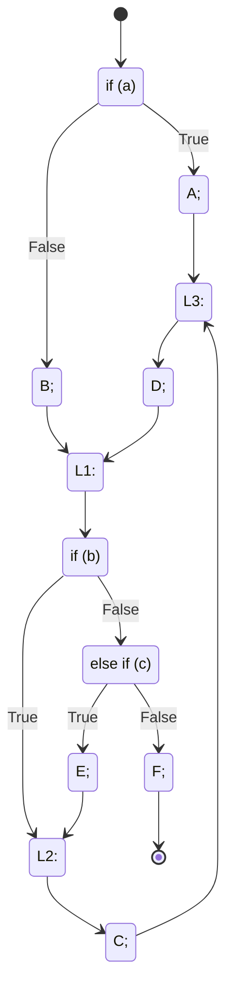

 

[](https://github.com/polystat/c2eo/actions?query=event%3Aschedule++)
[](https://github.com/polystat/c2eo/releases/latest)
[](https://codecov.io/gh/polystat/c2eo)

[](https://hitsofcode.com/view/github/polystat/c2eo)
[](https://github.com/polystat/c2eo/blob/master/license.txt)

This is a experimental translator of C ([ISO/IEC 9899:2018](https://www.iso.org/standard/74528.htm)) programs to [EO](https://www.eolang.org) programs.

## How to Use

Assuming, you are on [Ubuntu 22.04+](https://ubuntu.com/download):

```bash
$ apt update
$ apt install -y software-properties-common
$ apt-key adv --keyserver keyserver.ubuntu.com --recv-keys F7C91591CC543ECA
$ add-apt-repository 'deb http://c2eo.polystat.org/debian/ c2eo-rep non-free main contrib'
$ apt-get install -y clang
$ apt-get install -y c2eo
```

Then, just run:

```bash
$ c2eo <path-to-c-file-name> <eo-file-name>.eo
```

You can also use [yegor256/c2eo](https://hub.docker.com/r/yegor256/c2eo)
image via [Docker](https://docs.docker.com/get-docker/):

```bash
$ docker run -v $(pwd):/eo yegor256/c2eo hello.c hello.eo
```

Assuming you have `hello.c` in the current directory, the `hello.eo` will be created next to it.

We do not support the utility for other distributions and operating systems yet.
However, you can try to build the project from source at your own risk.

## How to Contribute

Again, we recommend [Ubuntu 22.04+](https://ubuntu.com/download) and you will need
[wget 1.21+](https://www.tecmint.com/install-wget-in-linux/), 
[tar 1.30+](https://www.tecmint.com/install-tar-in-centos-rhel-and-fedora/), 
[git 2.32.+](https://git-scm.com/book/en/v2/Getting-Started-Installing-Git),
[cmake 3.18+](https://cmake.org/download/), 
[gcc 11.2.+](http://mirror.linux-ia64.org/gnu/gcc/releases/), 
[g++ 11.2.+](https://pkgs.org/download/g++), 
[ninja-build 1.10.1+](https://ninja-build.org/), 
[clang 14.0.0+](https://releases.llvm.org/14.0.0/tools/clang/docs/)
and
[python3 3.10.0+](https://www.python.org/downloads/).
You will also need requirements for [the EO project](https://github.com/objectionary/eo) ([Maven 3.3+](https://maven.apache.org) and Java 8+)

Then, you need to install [GTest 1.12.1+](https://github.com/google/googletest)

```bash
$ apt install libgtest-dev googletest
$ cd /usr/src/googletest
$ cmake .
$ make
$ lib
$ cp *.a /usr/local/lib
```

After that, you need to install [LLVM/Clang 12.0.1](https://github.com/llvm/llvm-project/releases/tag/llvmorg-12.0.1) or you may use an alternative way below this code:

```bash
$ wget https://github.com/llvm/llvm-project/archive/refs/tags/llvmorg-12.0.1.tar.gz
$ tar -xvf llvmorg-12.0.1.tar.gz
$ mv ./llvm-project-llvmorg-12.0.1 ./llvm-clang
$ cd llvm-clang
$ mkdir build && cd $_
$ cmake --no-warn-unused-cli -DBUILD_SHARED_LIBS:STRING=ON -DLLVM_TARGETS_TO_BUILD:STRING=X86 -DCMAKE_EXPORT_COMPILE_COMMANDS:BOOL=TRUE "-DLLVM_ENABLE_PROJECTS:STRING=clang;compiler-rt" -DCMAKE_BUILD_TYPE:STRING=Debug -DLLVM_OPTIMIZED_TABLEGEN:STRING=ON -DLLVM_USE_SPLIT_DWARF:STRING=ON -DLLVM_USE_LINKER:STRING=gold ../llvm -G Ninja
$ cmake --build . --config Debug --target all -j 10 -- -j1 -l 2
$ cd ../..
```

You may also try our own [pre-packaged archive](https://mega.nz/file/cZ9WQCqB#z713CuC-GNFQAXIxZwZxI05zOH4FAOpwYHEElgOZflA):

```bash
$ apt install megatools
$ megadl 'https://mega.nz/#!cZ9WQCqB!z713CuC-GNFQAXIxZwZxI05zOH4FAOpwYHEElgOZflA'
$ tar -xvf llvm-clang.tar.gz
```

It is assumed that the `llvm-clang` dir is located in the `c2eo` dir. If your `llvm-clang` is in different place, set the path in that [line](https://github.com/polystat/c2eo/blob/master/project/src/transpiler/CMakeLists.txt#L6).

Formally speaking, this is where the preparation can be completed. However, in order to fully work with the project, testing and executing the translated code, you need to study the [EO compiler project](https://github.com/objectionary/eo) and fulfill its necessary requirements. After that, it will be possible to proceed with further steps.

### Making changes

All sources files of transpiler are located in `project/src/transpiler`. Аfter making changes in these files, we will need to rebuild the executable file `c2eo`. To do this, you need to go to the `project` dir. For the first time, create the `build` folder:

```bash
$ mkdir build
```

then go to the `build` folder and run the following commands:

```bash
$ cmake ..
$ make
``` 

As you have already noticed, the project is being built in the `project/build` folder. The result of this build is the `c2eo` file in `project/bin`. Now you have a transpiler and you can convert programs from C to EO. Just run:

```bash
$ ./c2eo <path-to-c-file-name> <eo-file-name>.eo
# ./c2eo ../some_dir/example.c example.eo
```

### Checking before creating PR

Your PR will pass the following checks, so before creating PR run these locally to make sure everything is ok:

1. [clang-format-14](https://pypi.org/project/clang-format/)
```bash
$ clang-format project/src/transpiler/*.(cpp|h) -i 
```

2. [cpplint](https://github.com/cpplint/cpplint)
```bash
$ cpplint --filter=-runtime/references,-runtime/string,-build/c++11 project/src/transpiler/** 
```
3. [clang-tidy](https://packages.ubuntu.com/en/bionic/clang-tidy)
```bash
$ cd project/scripts
$ python3 clang_tidy.py
```
4. [gcc.c-torture](https://github.com/polystat/c2eo/releases/download/0.1.16/gcc.c-torture.tar.gz)
```bash
$ cd project/scripts
$ python3 transpile.py <your_path_to_the_folder>/gcc.c-torture -s gcc -n
```

5. [c-testcuite](https://github.com/polystat/c2eo/releases/download/0.1.16/c-testcuite.tar.gz)
```bash
$ cd project/scripts
$ python3 test.py -p <your_path_to_the_folder>/c-testcuite -s testcuite -n
```

6. test
```bash
$ cd project/scripts
$ python3 test.py -s test
```

7. unit-tests
```bash
$ cd project/scripts
$ python3 build_c2eo.py
$ project/bin/
$ ./unit_tests --gtest_filter=*
```

## How to release

From `project/scripts/` directory:

```bash
$ python3 update-release.py -h
usage: update-release.py [-h] [--branch BRANCH] [--version VERSION]

Release maker

optional arguments:
  -h, --help         show this help message and exit
  --version VERSION  specify the new version
```

Example

```bash
$ python3 update-release.py --version=0.1.1
```

To use this script, make sure you have the following packages installed:

```bash
$ pip3 install git_config pgpy s3cmd
$ apt install md5deep reprepro gcc cmake dpkg wget tar s3cmd -y
# for the latest version of the cmake package, try:
$ pip3 install cmake
```

Notes:

* Use `.` as a version delimiter.
* This script uses the current date, time, and time zone. Make sure they are configured correctly.
* This script extracts your name and email from `git config`. Make sure you have them.

This script will write automatically generated merges to the changelog file.
You can view an approximate list of changes by running the following command in the terminal:

```bash
$ git log $(git describe --tags --abbrev=0)..HEAD --merges --oneline --format="  * %h %s by %an <%aE>"
```

### Algorithm:

* Build the executable file.
* Create a deb file (basic: [HABR](https://habr.com/ru/post/78094/))
* Create a repository (basic: [UNIXFORUM](https://unixforum.org/viewtopic.php?t=79513))
* Upload a repository tree into the bucket's virtual 'directory'.

<details>
<summary>The following files will be generated</summary>

    $ tree
    .
    ├── c2eo-X.X.X
    │   ├── DEBIAN
    │   │   ├── changelog
    │   │   ├── control
    │   │   ├── copyright
    │   │   └── md5sums
    │   └── usr
    │       ├── bin
    │       │   └── c2eo
    │       └── lib
    │           ├── libclangAnalysis.so
    │           ├── libclangAnalysis.so.12
    │           ├── ...
    │           └── libLLVMTransformUtils.so.12
    ├── c2eo-X.X.X.deb
    ├── readme.md
    ├── repository
    │   ├── conf
    │   │   └── distributions
    │   ├── db
    │   │   ├── checksums.db
    │   │   ├── contents.cache.db
    │   │   ├── packages.db
    │   │   ├── references.db
    │   │   ├── release.caches.db
    │   │   └── version
    │   ├── dists
    │   │   └── c2eo-rep
    │   │       ├── contrib
    │   │       │   ├── binary-amd64
    │   │       │   │   ├── Packages
    │   │       │   │   ├── Packages.gz
    │   │       │   │   └── Release
    │   │       │   ├── binary-i386
    │   │       │   │   ├── Packages
    │   │       │   │   ├── Packages.gz
    │   │       │   │   └── Release
    │   │       │   ├── debian-installer
    │   │       │   │   ├── binary-amd64
    │   │       │   │   │   ├── Packages
    │   │       │   │   │   └── Packages.gz
    │   │       │   │   └── binary-i386
    │   │       │   │       ├── Packages
    │   │       │   │       └── Packages.gz
    │   │       │   └── source
    │   │       │       ├── Release
    │   │       │       └── Sources.gz
    │   │       ├── InRelease
    │   │       ├── main
    │   │       │   ├── binary-amd64
    │   │       │   │   ├── Packages
    │   │       │   │   ├── Packages.gz
    │   │       │   │   └── Release
    │   │       │   ├── binary-i386
    │   │       │   │   ├── Packages
    │   │       │   │   ├── Packages.gz
    │   │       │   │   └── Release
    │   │       │   ├── debian-installer
    │   │       │   │   ├── binary-amd64
    │   │       │   │   │   ├── Packages
    │   │       │   │   │   └── Packages.gz
    │   │       │   │   └── binary-i386
    │   │       │   │       ├── Packages
    │   │       │   │       └── Packages.gz
    │   │       │   └── source
    │   │       │       ├── Release
    │   │       │       └── Sources.gz
    │   │       ├── non-free
    │   │       │   ├── binary-amd64
    │   │       │   │   ├── Packages
    │   │       │   │   ├── Packages.gz
    │   │       │   │   └── Release
    │   │       │   ├── binary-i386
    │   │       │   │   ├── Packages
    │   │       │   │   ├── Packages.gz
    │   │       │   │   └── Release
    │   │       │   ├── debian-installer
    │   │       │   │   ├── binary-amd64
    │   │       │   │   │   ├── Packages
    │   │       │   │   │   └── Packages.gz
    │   │       │   │   └── binary-i386
    │   │       │   │       ├── Packages
    │   │       │   │       └── Packages.gz
    │   │       │   └── source
    │   │       │       ├── Release
    │   │       │       └── Sources.gz
    │   │       ├── Release
    │   │       └── Release.gpg
    │   └── pool
    │       └── main
    │           └── c
    │               └── c2eo
    │                   └── c2eo_X.X.X_all.deb
    ├── todo.sh
    └── update-release.py
    
    35 directories, 120 files
</details>

Then you have to upload `./repository/dists` and `./repository/pool` to [c2eo.polystat.org/](http://c2eo.polystat.org)debian/.

## Principles of Transpilation from C to EO

C is a _system-level procedural_ programming language with direct access to the underlying hardware architecture elements, such as memory and registers. EO, on the other hand is a _high-level object-oriented_ language. There are a number of non-trivial mechanisms of translating constructs from the former to the latter, which are explained below:

:heavy_check_mark: [Implemented](#heavy_check_mark-implemented):
- [basic data types: double, int, bool, char, string](#direct-memory-access-for-basic-data-types)
- [const](#const)
- [arrays](#arrays)
- [structures](#structures)
- [unions](#unions)
- [functions](#functions)
- [function call operators](#function-call-operators)
- [multiple return](#multiple-return)
- [pointers](#pointers)
- [external links](#external-links)
- [if-else](#if-else)
- [while](#while)
- [do-while](#do-while)
- [for](#for)
- [break](#break)
- [continue](#continue)
- [switch case default](#switch-case-default)
- [operators](#operators)

:warning: [Partially implemented](#warning-partially-implemented):
- [uint64, float (not supported by EO)](#basic-types)
- [pointers on function](#pointers-on-function)

:x: [Not implemented](#x-not-implemented):
- [goto and labels](#goto-and-labels)
- [calling functions with variable number of arguments](#calling-functions-with-variable-number-of-arguments)
- [bitwise fields](#bitwise-fields)

### :heavy_check_mark: Implemented:

### Direct memory access for basic data types

Let's take the following C code as an example:

```c
double z = 3.14;
```

In EO, we represent the global memory space as a copy of [ram](https://github.com/polystat/c2eo/tree/master/result/eo/c2eo/system/ram.eo) object, which we call `global`. Thus, the variable `z` would be accessed as a block of 8 bytes inside `ram` at the very beginning, since it's the first variable seen. For example, to change the value of `z` we write 8 bytes to the 0th position of `global`:

```java
ram > global
global.write 0 (3.14.as-bytes)
```

### Const

We transform const like ordinary variable.

```c
const int a = 3;
if (a == 10) {
  ...
}
```

```java
a.write-as-int32 3 // only once
if
  a.read-as-int32.eq 10
  seq
    ...
    True
```

### Enums

We can work with enumerated types as well as with constants and substitute numeric values instead of names.

```c
enum State {Working = 1, Failed = 0};
if (10 == Working) {
  ...
}
```

```java
if
  10.eq 1
  seq
    ...
    True
  seq
    True
```

### Arrays

If we have fixed-size arrays we can work like with one-dimension array and calculate bias from start for any element and dimensions. In this example, we use a special object [address](https://github.com/polystat/c2eo/tree/master/result/eo/c2eo/system/address.eo), which makes it more convenient to read and write information from memory from a certain position. 

```c
int a[2] = { 5, 6 };
╭─────┬─────╮
|  5  │  6  │
├─────┼─────┤
| 0th │ 4th │
╰─────┴─────╯
```

```java
address global-ram 0 > a
a.write (4.mul 0) (5.as-bytes)
a.write (4.mul 1) (6.as-bytes)
```

### Structures

We know the size of structures so we generate additional objects that store the bias of the fields of the structure and allow access to them. For nested structures and other types, we can also calculate bias and generate corresponding objects.

```c
struct Rectangle {int x; int y;} rect;
rect.x = 5;
╭───────┬───────╮
| int x │ int y │
├───────┼───────┤
|  0th  │  4th  │
╰───────┴───────╯
```

```java
address global-ram 0 > rect
0 > x
4 > y
(rect.add x).write 5
```

### Unions

The size of the union is determined by the nested object with the maximum size. The main feature is that internal objects are located at the beginning of the same address. We do the same with nested structures.

```c
union { int a; int b; } u;
u.a = 5;
╭───────┬───────╮
| int a │ int b │
├───────┼───────┤
|  0th  │  0th  │
╰───────┴───────╯
```

```java
address global-ram 0 > u
0 > a
0 > b
(u.add a).write 5
```

### Functions

In a similar way we deal with function call, we calculate the necessary space for arguments (`param-start` and `param-size`) and local variables in `global` for each function call. The variable `r` will be "pushed" to `global` and accessible by the code inside the function `foo` by the 0th position with local offset. The local variable `x` will also be pushed to the `global` and will be accessible by the 4th with local offset, because the length of `int` is four. 
Also we use separate copy of `ram` named `return` for storing function return result. Here, we are trying to simulate the bevaviour of a typical C compiler. The declaration of `foo` and its execution may look like this:

```c
double pi = 3.14;
void circle(int r) {
  double x = 2 * pi * r;
  return x;
}
circle(10);
╭──────────┬───────┬──────────╮
| double z │ int r │ double x │ // variables in global
├──────────┼───────┼──────────┤
|    0th   │  8th  │   12th   │ // start position in global
╰──────────┴───────┴──────────╯
```

```java
address global-ram 0 > pi
[param-start param-size] > circle
  global.read param-start > r
  global.read (add param-start 4) > x
  seq > @
    x.write (2.mul (pi.mul r))
    return.write x

seq
  pi.write 0 3.14
  global.write 8 10 // write 10 to circle arguments stack
  circle 8 4        // arguments stack start from 8th byte and have 4 bytes for r
```

### Function call operators

The function has input variables and local variables. To determine the amount of memory for input variables, we use two parameters in the function description. For the convenience of accessing local variables, we use the bias `local-start` of the local position. To indicate a free position, we use `empty-local-position`. We divide the nested function call into several consecutive calls, the result of which is passed to subsequent calls.

```c
long long func1(long long x) {
  return x - 111;
}

long long func2(long long x) {
  return x - 10;
}

void main() {
  long long a;
  a = func1(func2(5));
  printf("%lld\n", a);
}  
```

```java
[param-start param-size] > func1
  add param-start param-size > local-start
  add local-start 0 > empty-local-position
  address global-ram (param-start.add 0) > x
  seq > @
    return.write (x.sub 111)
    TRUE

[param-start param-size] > func2
  add param-start param-size > local-start
  add local-start 0 > empty-local-position
  address global-ram (param-start.add 0) > x
  seq > @
    return.write (x.sub 10)
    TRUE

[] > main
  seq > @
    a.write // write func1 return in a
      seq
        write // write func2 return in temp place
          address global-ram (add empty-local-position 0) 
          seq
            write // write 5 to func2 arguments stack
              address global-ram (add empty-local-position 0)
              5
            ^.func2 empty-local-position 8
            return
        ^.func1 empty-local-position 8
        return
    printf "%d\n" a
```

### Multiple return

We generate a record of the result in a separate ram memory object. Further, other functions can read the result from there.
To solve the multiple return problem, we can use the [goto](https://github.com/objectionary/eo/blob/master/eo-runtime/src/main/eo/org/eolang/gray/goto.eo) object in eo. By wrapping the entire function in a similar object, we can interrupt its execution at any time. To do this, you just need to generate a g.forward call for each return.

```c
function {
  ...
  return <result_1>;
  ...
  return <result_2>;
  ...
  return <result_3>;
}
```

```java
[] > function
  goto > @
    [g]
      seq > @
        ...
        return.write <result_1>
        g.forward TRUE
        ...
        return.write <result_2>
        g.forward TRUE
        ...
        return.write <result_3>
        g.forward TRUE
```

### Pointers

C code may get an address of a variable, which is either in stack or in global memory:

```c
int f = 7;
void bar() {
  int t = 42;
  int* p = &t; // local scope
  *p = 500;    // write from local scope to local
  p = &f;      // global scope
  *p = 500;    // write from local scope to global
}
╭───────┬───────┬────────╮
| int f │ int t │ int* p │ // variables in global
├───────┼───────┼────────┤
|  0th  │  4th  │   8th  │ // start position in global
╰───────┴───────┴────────╯
```

However, as in C, our variables are located in `global` and have absolute address.
The object `param-start` provided as an argument to EO object `bar` is a calculated offset in `global` addressing the beginning of the frame for function call. Thus, `&t` would return `param-start + 0`, while `&f` would be just `0`:

```java
[param-start] > bar
  global.write
    8               // int* p
    param-start     // &t -> function offset position in global space
  global.write
    8
    0               // &f -> address of f in global

seq > @
  bar 4
```

### External links

To compile files with any external links, we use the following solution:

In the file where the external call is used, we generate the following alias

```c
#include <string>
strncpy(str2, str1, 8);
```

```java
+alias c2eo.external.strcpy
strncpy str2 st1 8
```

Сreating a file of the same name by the specified alias with an empty implementation

```java
+package c2eo.external

[args...] > strncpy
  TRUE > @
```

### If-else

In EO, we have an analog of an [if-else](https://github.com/polystat/c2eo/tree/master/project/eo-lib/coperators/if.eo) object, so we just convert without any significant changes.

```c
if (condition) {
  ...
}
else {
  ...
}
```

```java
if
  condition
  seq
    ...
    TRUE
  seq // else
    ...
    TRUE
```

### While

We can generate of C while on the EO by using [goto](https://github.com/objectionary/eo/blob/master/eo-runtime/src/main/eo/org/eolang/gray/goto.eo), conditional operator and analogs for break and continue.

```c
while (condition) {
  ...
}
```

```java
goto
  [while-loop-label]
    while-loop-label.backward > continue
    while-loop-label.forward TRUE > break
    if > @
      condition
      seq
        body
        continue
        TRUE
```

### Do-while

We can generate an analog of C do-while on EO by using nested [goto](https://github.com/objectionary/eo/blob/master/eo-runtime/src/main/eo/org/eolang/gray/goto.eo) for further checking by a conditional operator and analogs for break and continue.

```c
do {
  body
} while (condition)
```

```java
goto
  [do-while-loop-label-1]
    do-while-loop-label-1.forward TRUE > break
    seq > @
      goto
        [do-while-loop-label-2]
          do-while-loop-label-2.forward TRUE > continue
          body > @
      if
        condition
        do-while-loop-label-1.backward
      TRUE
```

### For

We can generate an analog of C for on EO using the nested [goto](https://github.com/objectionary/eo/blob/master/eo-runtime/src/main/eo/org/eolang/gray/goto.eo ) to execute loop-expression after executing the body of the loop, conditional operator and analogs for break and continue.

```c
for(init;condition;loop-expression) {
  body
}
```

```java
init
goto
  [for-loop-label-1]
    for-loop-label-1.forward TRUE > break
    if > @
      condition
      seq
        goto
          [for-loop-label-2]
            for-loop-label-2.forward TRUE > continue
            body > @
        loop-expression
        for-loop-label-1.backward
        TRUE
```

### Break

With [goto](https://github.com/objectionary/eo/blob/master/eo-runtime/src/main/eo/org/eolang/gray/goto.eo) object we can transofrm any number of breaks in cycle to g.forward TRUE call.

```c
while (condition) {
  ...
  break;
  ...
}
```

```java
goto
  [while-loop-label]
    while-loop-label.backward > continue
    while-loop-label.forward TRUE > break
    if > @
      condition
      seq
        ...
        break
        ...
        TRUE
```

### Continue

With [goto](https://github.com/objectionary/eo/blob/master/eo-runtime/src/main/eo/org/eolang/gray/goto.eo) object we can transofrm any number of continue in cycle to g.backward call.

```c
while (condition) {
  ...
  continue;
  ...
}
```

```java
goto
  [while-loop-label]
    while-loop-label.backward > continue
    while-loop-label.forward TRUE > break
    if > @
      condition
      seq
        ...
        continue
        ...
        TRUE
```

### Switch case default

We can convert such simple switch statement to [goto](https://github.com/objectionary/eo/blob/master/eo-runtime/src/main/eo/org/eolang/gray/goto.eo) object.

```c
switch (x): {
 case 1:
  op1;
  break;
 case 2:
 case 3:
  op2;
  break;
 case 4:
  op3;
 case 5:
  op4;
  break;
 case 6:
 default:
  op6:
  break;
}
```

```java
  memory > flag
  goto > @
    [end]
      seq > @
        write flag 0
        if
          or (eq x 1) flag
          seq
            write flag 1
            op1
            end.forward TRUE
            TRUE
        if
          or (eq x 2) flag
          seq
            write flag 1
            TRUE
        if
          or (eq x 3) flag
          seq
            write flag 1
            op2
            end.forward TRUE
            TRUE
        if
          or (eq x 4) flag
          seq
            write flag 1
            op3
            TRUE
        if
          or (eq x 5) flag
          seq
            write flag 1
            op4
            end.forward TRUE
            TRUE
        if
          or (eq x 6) flag
          seq
            write flag 1
            TRUE
        op6
        end.forward TRUE
        TRUE
```

### Operators

The table of all C operators and similar objects in the EO.

С|EO
-|-
+|[plus](https://github.com/polystat/c2eo/tree/master/project/eo-lib/coperators/plus.eo)
-|[minus](https://github.com/polystat/c2eo/tree/master/project/eo-lib/coperators/minus.eo)
*|[times](https://github.com/polystat/c2eo/tree/master/project/eo-lib/coperators/times.eo)
*|[write\|read-as-\<type>](https://github.com/polystat/c2eo/tree/master/project/eo-lib/coperators/read-as-int64.eo)
/|[div](https://github.com/polystat/c2eo/tree/master/project/eo-lib/coperators/div.eo)
=|[write-as-\<type>](https://github.com/polystat/c2eo/tree/master/project/eo-lib/coperators/write-as-int64.eo)
%|[mod](https://github.com/polystat/c2eo/tree/master/project/eo-lib/coperators/mod.eo)
+x|[pos](https://github.com/polystat/c2eo/tree/master/project/eo-lib/coperators/pos.eo)
-x|[neg](https://github.com/polystat/c2eo/tree/master/project/eo-lib/coperators/neg.eo)
++x|[pre-inc-\<type>](https://github.com/polystat/c2eo/tree/master/project/eo-lib/coperators/pre-inc-int64.eo)
x++|[post-inc-\<type>](https://github.com/polystat/c2eo/tree/master/project/eo-lib/coperators/post-inc-int64.eo)
--x|[pre-dec-\<type>](https://github.com/polystat/c2eo/tree/master/project/eo-lib/coperators/pre-dec-int64.eo)
x--|[post-dec-\<type>](https://github.com/polystat/c2eo/tree/master/project/eo-lib/coperators/post-dec-int64.eo)
==|[eq](https://github.com/polystat/c2eo/tree/master/project/eo-lib/coperators/eq.eo)
!=|[neq](https://github.com/polystat/c2eo/tree/master/project/eo-lib/coperators/neq.eo)
<|[lt](https://github.com/polystat/c2eo/tree/master/project/eo-lib/coperators/lt.eo)
<=|[lte](https://github.com/polystat/c2eo/tree/master/project/eo-lib/coperators/lte.eo)
\>|[gt](https://github.com/polystat/c2eo/tree/master/project/eo-lib/coperators/gt.eo)
\>=|[gte](https://github.com/polystat/c2eo/tree/master/project/eo-lib/coperators/gte.eo)
&&|[and](https://github.com/polystat/c2eo/tree/master/project/eo-lib/coperators/and.eo)
\|\||[or](https://github.com/polystat/c2eo/tree/master/project/eo-lib/coperators/or.eo)
!|[not](https://github.com/polystat/c2eo/tree/master/project/eo-lib/coperators/not.eo)
&|[bit-and](https://github.com/polystat/c2eo/tree/master/project/eo-lib/coperators/bit-and.eo)
&|[addr-of](https://github.com/polystat/c2eo/tree/master/project/eo-lib/coperators/addr-of.eo)
\||[bit-or](https://github.com/polystat/c2eo/tree/master/project/eo-lib/coperators/bit-or.eo)
^|[bit-xor](https://github.com/polystat/c2eo/tree/master/project/eo-lib/coperators/bit-xor.eo)
~|[bit-not](https://github.com/polystat/c2eo/tree/master/project/eo-lib/coperators/bit-not.eo)
<<|[shift-right](https://github.com/polystat/c2eo/tree/master/project/eo-lib/coperators/shift-right.eo)
\>>|[shift-left](https://github.com/polystat/c2eo/tree/master/project/eo-lib/coperators/shift-left.eo)
(type casting)|[as-\<type>](https://github.com/polystat/c2eo/tree/master/project/eo-lib/coperators/as-int64.eo)

```c
x += 10;
```

For assignment operations, we generate the following constructs

```java
x.write (x.add 10)
```

### :warning: Partially implemented:

### Basic types

In EO, an implementation of at least 8 bytes is used to store floating-point numbers. At the moment, full support for numbers with fewer bytes is not possible. So far, to work with such numbers, we also use 8 bytes for storage.

```c
float b = 5.0; // 4 bytes
```

```java
write-as-float32 b 5.0 // 8 bytes
```

At the moment, the largest type in EO is int64, there is no support for uint64 numbers and it crashes with an error at the compilation stage. The current implementation supports numbers in the range of type uint56

```c
unsigned long long int c = 10223372036854775807;
```

```java
write-as-uint64 c 10223372036854775807
// [COMPILATION EXCEPTION] the number is too high
```

### Pointers on function

> Source: https://stackoverflow.com/questions/840501/how-do-function-pointers-in-c-work

Let's start with a basic function which we will be pointing to:

```c
int addInt(int n, int m) {
  return n + m;
}
```

First thing, let's define a pointer to a function which receives 2 ints and returns an int:

```c
int (*functionPtr)(int, int);
```

Now we can safely point to our function:

```c
functionPtr = &addInt;
```

In EO we generate special object `call` with array for storing all function call:

```java
[index param-start param-size] > call
    at. > @
      *
        <function_name_1> param-start param-size
        addInt param-start param-size // our function has an index of 1
        ...        
        <function_name_n_n> param-start param-size
      index
```

Now, if we want to assign the function to a pointer, we replace this expression with a specific index value of this function in our array

```java
write-as-ptr functionPtr 1
```

Now that we have a pointer to the function, let's use it:

```c
int sum = (*functionPtr)(2, 3); // sum == 5
```

```java
... // before calling the function, we place its arguments in memory
write-as-int32
  sum
  call
    param-start 
    param-size
    read-as-ptr functionPtr // return 1
```

> Current development at this stage

Passing the pointer to another function is basically the same:

```c
int add2to3(int (*functionPtr)(int, int)) {
  return (*functionPtr)(2, 3);
}
```

We can use function pointers in return values as well (try to keep up, it gets messy):

```c
// this is a function called functionFactory which receives parameter n
// and returns a pointer to another function which receives two ints
// and it returns another int
int (*functionFactory(int n))(int, int) {
  printf("Got parameter %d", n);
  int (*functionPtr)(int, int) = &addInt;
  return functionPtr;
}
```

But it's much nicer to use a typedef:

```c
typedef int (*myFuncDef)(int, int);
// note that the typedef name is indeed myFuncDef

myFuncDef functionFactory(int n) {
  printf("Got parameter %d", n);
  myFuncDef functionPtr = &addInt;
  return functionPtr;
}
```

### :x: Not implemented

### Goto and labels

Current [goto](https://github.com/objectionary/eo/blob/master/eo-runtime/src/main/eo/org/eolang/gray/goto.eo) object can replace continue and break, but goto in C can jump anywhere in function body.

```C
if (a) {
  A;
  goto L3;
}
B;
L1:
if (b) {
L2:
  C;
L3:
  D;
  goto L1;
}
else if (c) {
  E;
  goto L2;
}
F;
```



### Calling functions with variable number of arguments

Also in C it is possible to call a function with a variable number of arguments. The main problem for the implementation in EO is the use in C and special libraries (`va_start, va_end and itc.`) for reading arguments in such functions.

```c
double average(int num,...) {
  va_list valist;
  double sum = 0.0;
  int i;
  /* initialize valist for num number of arguments */
  va_start(valist, num);
  /* access all the arguments assigned to valist */
  for (i = 0; i < num; i++) {
    sum += va_arg(valist, int);
  }
  /* clean memory reserved for valist */
  va_end(valist);
  return sum / num;
}

int main() {
  printf("Average of 1, 2, 3, 4 = %f\n", average(4,  1, 2, 3, 4));
  printf("Average of 1, 2, 3 = %f\n",    average(3,  1, 2, 3));
}
```

### Bitwise fields

In the C language, bitwise fields can be formed as structures. They provide access to
individual bits of signed and unsigned numbers. EO does not support bits, so their direct implementation is impossible.

```c
 // memory-optimized date storage structure
struct date {
  unsigned int day: 5; // the maximum value of days is 31, so we need 5 bits for this
  unsigned int month: 4; // the maximum value of months us 12, so weed 4 bits for this
  unsigned int year;
};

struct date d = {15, 7, 2022};
printf("Date size is: %lu bytes\n", sizeof(d)); // 8 bytes instead 12
printf("Date is %d.%d.%d", d.day, d.month, d.year); // 15.7.2022
```
